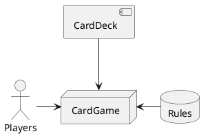

# Card Game Design

A couple of components / classes:

## Card

Composed of `suit` and `rank`

## CardDeck

A `List` of `Card`s

## Player

Each player has a name and a hand (`List` of `Card`s)

## CardGameType

- Name of the CardGameType
- Constraints on players
- Rules how the game type is played
    - num_cards_per_player: how many cards per player (dealer aspect)
       - slightly more complex property - may be a function of num_players
    - Stack?: stack-based game? ? etc.
    - Trick?: trick-based game?
    - OtherThanStackOrTrick?: head-to-head (black jack)? sequence-based (patience)
    - card-reveal mechanism: reveal full hand? reveal one at a time?
    - on Stack: draw card mechanism: take one from stack?
    - on Trick: take one from trick? take full trick?
    - card comparison (might have default order in CardDeck)
    - Turn: normally, clockwise. Some games allow barge-in for anyone..
    - WinningCondition: when is the game won
- Rules might be persisted in storage, retrieved based on CardGameType and injected into the `CardGame`

## CardGame

Composed of `List` of `Players`, `Rules`, and `CardDeck`

A `CardGame` engine would typically involve the following activities:

- deal cards: distribute a specific number of cards to the players, i.e. furnish each player with a hand
- drive player turns: rotate through players to give each player the initiative to execute an action with their hand
- test winning condition at each turn
